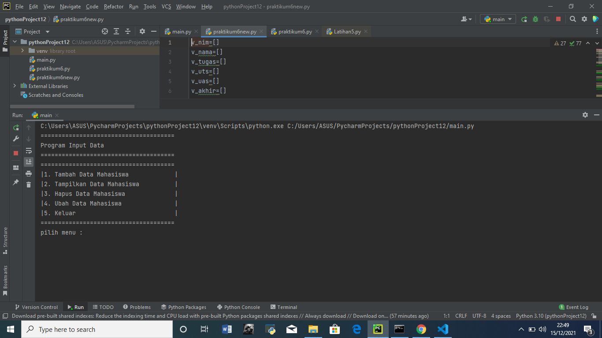

# Latihan6
contoh penggunaan fungsi di python

PENGGUNAAN FUNGSI PADA PYTHON
Fungsi adalah set perintah yang digunakan untuk mengelolah data sehingga mendaptkan nilai baru.
Nilai baru ini dapat dipakai pada fungsi atau prosedur lain di dalam program tersebut.
Tujuan Pembuatan Fungsi adalah untuk mengefisiensikan penulisan kode kode program.

# Membuat Fungsi
Struktur pembuatan fungsi pada python yaitu :
def nama_fungsi():

# Contoh pembuatan Fungsi
Berikut Contoh penggunaan fungsi untuk program menginput data mahasiswa.
v_nim=[]
v_nama=[]
v_tugas=[]
v_uts=[]
v_uas=[]
v_akhir=[]

def judul():
    print("======================================")
    print("Program Input Data")
    print("======================================")

def menu():
    judul()
    print("======================================")
    print("|1. Tambah Data Mahasiswa             |")
    print("|2. Tampilkan Data Mahasiswa          |")
    print("|3. Hapus Data Mahasiswa              |")
    print("|4. Ubah Data Mahasiswa               |")
    print("|5. Keluar                            |")
    print("======================================")
    pilih2=input("pilih menu : ")
    if pilih2 == "1":
        tambah()
    elif pilih2 == "2":
        tampilkan()
    elif pilih2 == "3":
        hapus()
    elif pilih2 == "4":
        ubah()
    elif pilih2 == "5":
        keluar()
    else:
        tidak = input("menu tidak tersedia")
        menu()

def tambah():
    judul()
    print("Tambahkan Data Mahasiswa".center(40))
    print("========================================")
    nama = input("Nama : ")
    v_nama.append(nama)
    nim = input(" NIM : ")
    v_nim.append(nim)
    tugas = float(input("Niali Tugas : "))
    n_tugas = tugas * (30 / 100)
    v_tugas.append(n_tugas)
    uts = float(input("Niali UTS : "))
    n_uts = uts * (35 / 100)
    v_uts.append(n_uts)
    uas = float(input("Niali UAS : "))
    n_uas = uas * (35 / 100)
    v_uas.append(n_uas)
    total = n_tugas + n_uts + n_uas
    v_akhir.append(total)
    print("Simpan Data".center(40))
    kembali = input("kembali[enter]")
    menu()

def tampilkan():
    judul()

    for i in range(len(v_nim)):
        print("%d. Nim        :%i" % (i + 1, v_nim[i]))
        print(" Nama         :%s" % v_nama[i])
        print(" Nilai Tugas  :%i" % v_tugas[i])
        print(" Nilai UTS    :%i" % v_uts[i])
        print(" Nilai UAS    :%i" % v_uas[i])
        print(" Niali Akhir  :%i" % v_akhir[i])

    kembali = input("kembalai tekan [enter]")
    menu()

def hapus():
    judul()
    print("Hapus Data Mahasiswa".center(40))
    print("=================================================")
    i = int(input("Masukan id : "))
    if i in v_nim[i]:
        print("id salah")

    else:
        v_nim.remove(v_nim[i])
        v_nama.remove(v_nama[i])
        v_tugas.remove(v_tugas[i])
        v_uts.remove(v_uts[i])
        v_uas.remove(v_uas[i])
        v_akhir.remove(v_akhir[i])
        menu()

    print("Data berhasil dihapus")
    kembali = input("kembali[enter]")
    menu()

def ubah():
    rubah = input("Ubah Biodata / niali (B/b):")
    i = int(input("Masukan id : "))
    if i in v_nim:
       print("id salah")
    else:
        nama_baru = input("Nama : ")
        v_nama[i] = nama_baru
        nim_baru = input("NIM : ")
        v_nim[i] = nim_baru
        tugas_baru = float(input("Niali Tugas : "))
        n_tugasbaru = tugas_baru * (30 / 100)
        v_tugas[i] = n_tugasbaru
        uts_baru = float(input("Nilai UTS : "))
        n_utsbaru = uts_baru * (35 / 100)
        v_uts[i] = n_utsbaru
        uasbaru = float(input("Nilai UAS : "))
        n_uasbaru = uasbaru * (35 / 100)
        v_uas[i] = n_uasbaru
        totalbaru = n_tugasbaru + n_utsbaru + n_uasbaru
        v_akhir[i] = totalbaru

    kembali = input("kembali[enter]")
    menu()
def keluar():
    menu()
menu()

Apabila kode program diatas dijalankan maka akan menghasilkan output seperti berikut.

